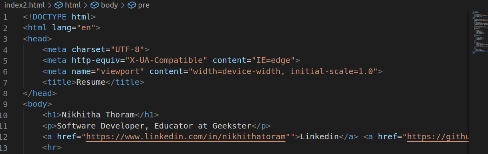
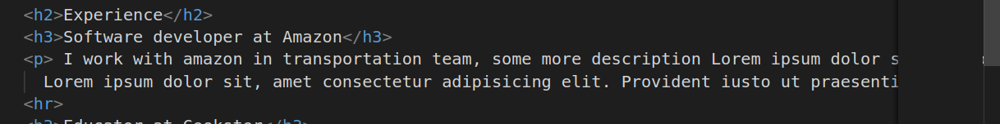
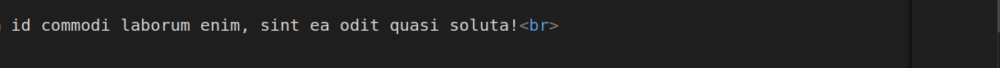
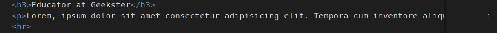
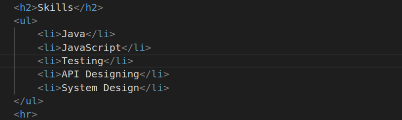
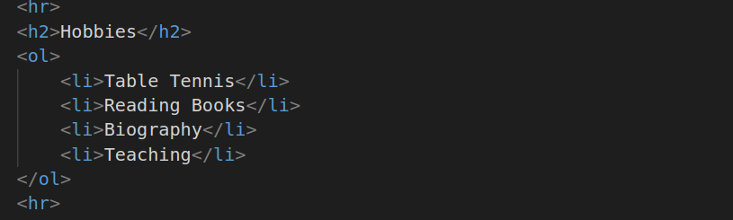
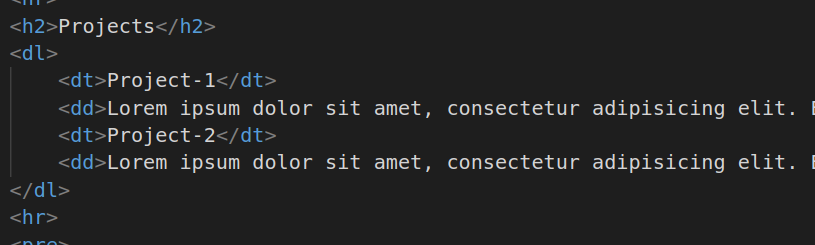
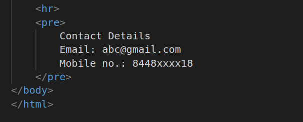

# The gallery Cake
My Project Explanation

1.
##### Explanation
* Here h1 tag is used for heading
* p is used for paragraph
* a is anchor tag and href is used to determine destination to source and i have provided my linkedin and github profile linkes here
* hr tag is used for horizantal rule or thematic break in an HTML page

2.
##### Explanation
* h2 is second heading tag
* h3 is third heading tag
* p is used for paragraph

3.
##### Explanation
* br is used for line break

4.
##### Explanation
* h3 is used for third heading
* p is used for paragraph

5.
##### Explanation
* h2 is used for second heading
* ul is unordered list it will lists items unordered.

6.
##### Explanation
* h2 is used for second heading
* ol is ordered list it will lists all items in order and it provides numbering for every item

7.
##### Explanation
* h2 used for second heading
* dl is description list
* dt is used to specify name of that list
* dd is used to describe the content 

8.
##### Explanation
* prev tag will show as it is how we write.
